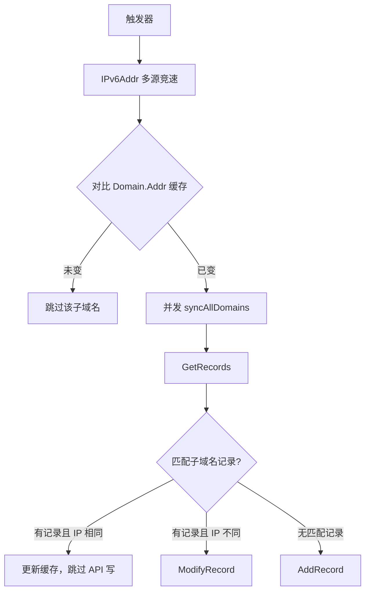

# 架构与运行原理

本文说明 ddns6 核心服务的数据流、地址变化触发机制、防抖策略、DNS 同步流程与 IPv6 多源获取。运营商接入与部署方式分别见 [`docs/providers.md`](providers.md) 与 [`docs/deployment.md`](deployment.md)。

## 总体架构

ddns6 服务入口为 `ddns.RunService`（`internal/ddns/service.go`）。启动后持续监听本机 IPv6 地址变化，获取公网 IPv6 后并发同步各子域名的 DNS 记录。

### 数据流

```
地址变化 → IPv6Addr（多源并发） → 对比缓存
  ├─ 未变 → 跳过
  └─ 已变 → 并发同步各子域名
        ├─ GetRecords
        ├─ IP 相同 → 跳过；不同 → ModifyRecord
        └─ 无记录 → AddRecord
```



### 模块职责

| 模块 | 路径 | 职责 |
|------|------|------|
| 服务编排 | `internal/ddns/service.go` | 启动流程、触发循环、信号处理、并发同步调度 |
| 平台触发 | `internal/ddns/service_linux.go` / `service_other.go` | Linux Netlink 或轮询触发 |
| 记录同步 | `internal/ddns/record.go` | 单域名缓存比对与 DNS CRUD |
| 批量查询 | `internal/ddns/processor.go` | 按根域名分组查询（供 `records` / `clean` 子命令） |
| IPv6 获取 | `pkg/ipaddr` | 多 Fetcher 随机顺序并发竞速 |
| 运营商实现 | `internal/providers/*` | 各 DNS 服务商 API 适配 |

## 地址变化触发

触发器由 `startTrigger` 按平台实现，向 `RunService` 主循环发送非阻塞信号（`triggerCh`，容量 1）。

### 触发器对照表

| 平台 / 场景 | 机制 | 说明 |
|-------------|------|------|
| Linux（默认） | Netlink `RTM_NEWADDR` | 订阅内核地址新增事件；仅处理 IPv6 且 `IP.IsGlobalUnicast()` 为真的地址（过滤 IPv4、link-local、loopback 等非全局单播）。**注意：** Go 中 ULA（`fc00::`/`fd00::`）通常 `IsGlobalUnicast()==true`，当前实现仍可能因 ULA 事件触发 |
| 非 Linux | 定时轮询 | 按 `--interval` / 配置 `interval` 周期触发；**默认 5 分钟** |
| Linux Netlink 失败 | 回退轮询 | 订阅失败、指定网卡解析失败、或 update channel 关闭时，改用与配置相同的 `interval` 轮询 |

Linux 可通过 `--interface` / 配置 `interface` 限定监听网卡；非 Linux 平台忽略该参数。

### 防抖（仅 Linux Netlink）

PPPoE 重拨等场景下，新地址可能在短时间内多次上报。Linux 实现使用 **10 秒**防抖窗口（`debounceDuration = 10 * time.Second`）：

1. 检测到符合条件的 `RTM_NEWADDR` 后启动或重置计时器；
2. 窗口内若再有新事件，计时器**重置**，不立即触发同步；
3. 计时器到期后向 `triggerCh` 发送一次触发信号。

非 Linux 轮询模式无防抖，每个 tick 直接触发。

## 启动与运行时行为

### 启动阶段（fail-fast）

1. 立即调用 `IPv6Addr` 获取当前 IPv6；
2. 调用 `syncAllDomains(..., failFast=true)` 并发同步所有子域名；
3. 任一步失败则**终止启动**并返回 error。

### 运行阶段

收到触发信号后，在独立 goroutine 中再次 `IPv6Addr` 并 `syncAllDomains(..., failFast=false)`：

- 获取 IPv6 失败：仅记录 error 日志，服务继续运行；
- 单个子域名同步失败：仅记录 error 日志，其余子域名照常处理。

### 优雅关闭

收到 **SIGINT** 或 **SIGTERM** 后：

1. 取消 context，传播至进行中的 IPv6 获取与 DNS API 调用；
2. **最多等待 5 秒**，让当前同步 goroutine 结束；
3. 超时则记录 warn 日志后退出；正常结束返回 `nil`。

## DNS 同步流程

单个子域名由 `SyncRecord`（`internal/ddns/record.go`）处理，受 `Domain` 内嵌锁保护。

### 缓存比对

`hasAddressChanged` 比较 `Domain.Addr` 与本次获取的 IPv6：

- 缓存为 `nil`（首次）→ 视为已变化，进入同步；
- 地址相同 → 跳过，避免无效 API 调用；
- 地址不同 → 执行 `syncDNSRecord`。

### 记录 CRUD

`syncDNSRecord` 流程：

1. `GetRecords` 查询目标 FQDN 与记录类型（通常为 AAAA）；
2. 用 `RecordNameMatches` 匹配子域名（兼容各服务商记录名格式差异）；
3. **有匹配记录**：IP 相同则更新本地缓存并跳过；IP 不同则 `ModifyRecord`；
4. **无匹配记录**：`AddRecord` 新建；
5. 同一子域名存在多条匹配记录时**全部处理**（修改或跳过，而非只处理第一条）。

`syncAllDomains` 对所有 `Domain` 并发调用 `SyncRecord`（`sync.WaitGroup`）。

## IPv6 多源获取

默认来源由 `DefaultIPv6Fetchers()` 提供（共 **7** 个）。每次 `IPv6Addr` 调用时：

1. 随机打乱 fetcher 顺序，避免长期偏倚某一上游；
2. 并发执行，取**第一个成功**结果（竞速总超时 5 秒）；
3. 全部失败则返回汇总错误。

### 默认来源表

| 来源 | 类型 |
|------|------|
| `https://6.ipw.cn` | HTTP |
| `https://ifconfig.co` | HTTP |
| `https://v6.ident.me` | HTTP |
| `2402:4e00::` | DNS |
| `2400:3200:baba::1` | DNS |
| `2001:4860:4860::8888` | DNS |
| `2606:4700:4700::1111` | DNS |

- **HTTP Fetcher**：请求纯文本 IPv6 端点，解析响应体；
- **DNS Fetcher**：向指定 IPv6 地址发起 UDP6 拨号，取本地出口地址作为公网 IPv6。

库调用方可传入自定义 `[]ipaddr.IPv6Fetcher` 覆盖默认列表；CLI 默认使用 `DefaultIPv6Fetchers()`。

## 关键常量摘要

| 常量 | 值 | 位置 |
|------|-----|------|
| Netlink 防抖 | 10s | `internal/ddns/service_linux.go` |
| 优雅关闭等待 | 5s | `internal/ddns/service.go` |
| IPv6 竞速超时 | 5s | `pkg/ipaddr/ipv6.go` |
| 非 Linux 默认轮询 | 5m | CLI / 配置 `interval` 默认值 |
| 默认 DNS TTL | 600s | `internal/ddns/types.go` |
