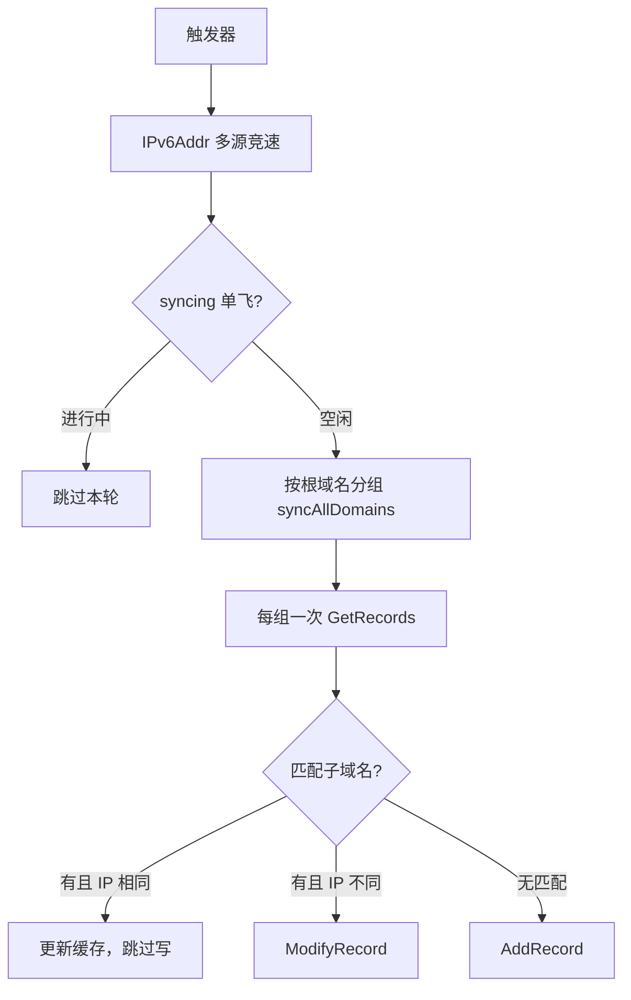

# 架构与运行原理

本文说明 ddns6 核心服务的数据流、地址变化触发、防抖、DNS 同步与 IPv6 多源获取。运营商与部署见 [`docs/providers.md`](providers.md)、[`docs/deployment.md`](deployment.md)。

## 总体架构

服务入口为 `ddns.RunService`（`internal/ddns/service.go`）。启动后监听本机 IPv6 变化，获取公网 IPv6，再按根域名分组同步各子域名的 AAAA 记录。

### 数据流

```
地址变化 → IPv6Addr（多源并发） → 对比 Domain.addr 缓存
  ├─ 未变 → 跳过该子域名
  └─ 已变 → 按根域名分组
        ├─ 同 zone 一次 GetRecords（zone 级列表）
        ├─ IP 相同 → 跳过写；不同 → ModifyRecord
        └─ 无匹配记录 → AddRecord
```



### 模块职责

| 模块 | 路径 | 职责 |
|------|------|------|
| 服务编排 | `internal/ddns/service.go` | 启动、触发循环、单飞同步、信号处理、metrics |
| 平台触发 | `service_linux.go` / `service_other.go` | Netlink 或轮询 |
| 记录应用 | `record.go` / `match.go` | 缓存比对、`applyDNSRecords`、名称匹配 |
| 批量查询 | `processor.go` | `records` / `clean` 按根域名分组查询 |
| HTTP 工具 | `internal/httputil` | 安全客户端、脱敏、有界读体 |
| 指标 | `internal/metrics` | 可选 loopback `/metrics` |
| IPv6 | `pkg/ipaddr` | 多 Fetcher 竞速 |
| 域名工具 | `pkg/domainutil` | `SplitDomain`、`ZoneCandidates` |
| 运营商 | `internal/providers/*` | 各 DNS API；`GetRecords` 应对 root 返回 zone 内该类型全部记录 |

## 地址变化触发

`startTrigger` 向主循环发送非阻塞信号（`triggerCh`，容量 1）。

| 平台 / 场景 | 机制 | 说明 |
|-------------|------|------|
| Linux（默认） | Netlink `RTM_NEWADDR` | 仅处理全局单播 IPv6；ULA 在 Go 中通常仍视为 GlobalUnicast，可能触发同步 |
| 非 Linux | 定时轮询 | `--interval` / `interval`，默认 **5m** |
| Linux Netlink 失败 | 回退轮询 | 订阅失败、网卡解析失败或 channel 关闭时，用同一 `interval` |

Linux 可用 `--interface` 限定网卡；非 Linux 忽略。

### 防抖（仅 Linux Netlink）

窗口 **10 秒**（`debounceDuration`）：事件到来时启动或重置计时器，窗口内不再发触发；到期后向 `triggerCh` 发一次。轮询模式无防抖。

## 启动与运行时

### 启动（fail-fast）

1. `IPv6Addr` 取当前地址；
2. `syncAllDomains(..., failFast=true)`；
3. 任一组失败则终止启动。

### 运行中

触发后在独立 goroutine 中同步，且 **`syncing` 单飞**：上一轮未结束则跳过本轮，避免堆积。

- 取地址失败：记日志，服务继续；
- 单组同步失败：记日志（非 fail-fast 不叠层打多次）。

### 优雅关闭

SIGINT / SIGTERM → 取消 context → **最多等待 5 秒** → 超时 warn 后退出。

## DNS 同步

### 同根域合并查询

`syncAllDomains` 按 `(根域名, 记录类型)` 分组：

1. 组内先按缓存过滤「地址未变」的子域名；
2. 若仍有待更新项，对该 root **只调用一次** `GetRecords(ctx, root, typ)`；
3. 对每个子域名 `applyDNSRecords`（匹配 → 跳过/修改，或新建）。

因此各 provider 的 `GetRecords` 应以 **zone 范围**列出指定类型记录（编排层再按子域名过滤），而不是只返回单个 FQDN。

组并发受 `maxSyncGroupConcurrency` 限制。`Domain` 锁仅保护本地 `addr` 缓存，**不**跨 DNS I/O 持锁。

### 记录匹配

`RecordNameMatches` 兼容各厂商记录名格式差异。同子域名多条匹配记录会全部处理。

TTL：写入路径统一经 `RecordTTL`（零值回退默认 600）。

## IPv6 多源获取

`DefaultIPv6Fetchers()` 共 **7** 个来源。每次调用随机打乱顺序，并发竞速（总超时 **5s**），取首个成功结果；失败尊重 `ctx` 取消。

| 来源 | 类型 |
|------|------|
| `https://6.ipw.cn` | HTTP |
| `https://ifconfig.co` | HTTP |
| `https://v6.ident.me` | HTTP |
| `2402:4e00::` | DNS |
| `2400:3200:baba::1` | DNS |
| `2001:4860:4860::8888` | DNS |
| `2606:4700:4700::1111` | DNS |

HTTP Fetcher 仅接受 2xx；DNS Fetcher 通过 UDP6 拨号取本地出口地址。

## 可选 Metrics

`--metrics-addr` / `DDNS6_METRICS_ADDR` 非空时启动 Prometheus 文本 `/metrics`，**仅允许 loopback**（如 `127.0.0.1:9090`）。空则禁用。

## 关键常量

| 常量 | 值 | 位置 |
|------|-----|------|
| Netlink 防抖 | 10s | `service_linux.go` |
| 优雅关闭等待 | 5s | `service.go` |
| IPv6 竞速超时 | 5s | `pkg/ipaddr/ipv6.go` |
| 默认轮询 | 5m | CLI / 配置 |
| 默认 TTL | 600s | `types.go` `RecordTTL` |
